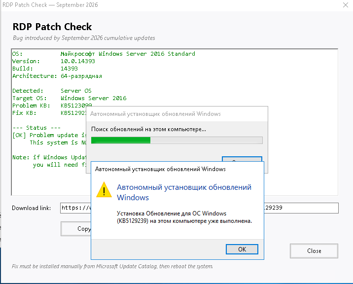
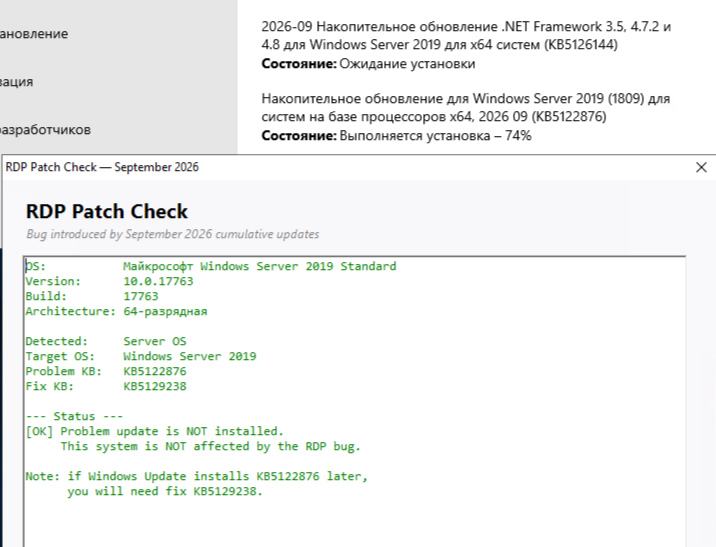

**English** | [Русский](README.ru.md)

# Check-RdpPatch

A diagnostic tool for the RDP hang bug introduced by the September 2026 Windows cumulative updates.


## How to use

### Step 1. Download and prepare

- Download `Check-RdpPatch.exe`.
- Move it out of the **Downloads** folder — Windows may block the launch otherwise.
- If SmartScreen appears, click **More info → Run anyway**.

### Step 2. Run the check

- Double-click `Check-RdpPatch.exe`.
- A window with results will open.

### Step 3. Read the verdict

One of three states will be shown:

| What you see | What it means | What to do |
|---|---|---|
| "Problem update is NOT installed" | The bug has not reached this PC | Nothing. Keep an eye on updates |
| "Fix IS installed" | The bug is present but already mitigated | Nothing |
| "Fix is NOT installed. ACTION REQUIRED" | The bug is present, unprotected | Download the fix (Step 4) |

### Step 4. Install the fix (if required)

1. In the app window, click **Open in browser** — the Microsoft Update Catalog opens.
2. Find the **x64** package and click **Download**.
3. Copy the **current** `.msu` URL — Microsoft's dynamic links expire quickly.
4. Install the fix. Either via PowerShell:

```
Start-Process wusa.exe -ArgumentList "C:\Temp\KBxxxxxxx.msu /quiet /norestart" -Wait
```

Or by double-clicking the downloaded `.msu`.

5. Verify the installation:

```
Get-HotFix -Id KBxxxxxxx
```

6. **Reboot the machine.** The fix does not take effect without a reboot.

### Step 5. Re-check

Run `Check-RdpPatch.exe` again. The verdict should now read "Fix IS installed".

### If the fix is already installed

Running the `.msu` installer again will report that the update is already installed on this computer. This is expected — no second installation is needed, and it will not harm the system.



## What to do right now

If the problematic update is being installed right now (Windows Update shows the progress bar), act quickly.



### 1. Immediately check the installation status

Open PowerShell as Administrator and run:

```
Get-HotFix -Id KB5122876
```

- If the command returns information about the update — it is installed. Go to step 2.
- If you get "Not found" — the update has not been applied yet. It may be in progress or waiting for a reboot. Go to step 3.

### 2. If the update is installed — DO NOT reboot the server

This is important. The RDP hang typically appears after the first reboot or user logoff. You have a brief window to install the fix before the bug manifests. Proceed immediately with installing KB5129238 using Check-RdpPatch.

### 3. If the update is not yet installed — block it

If possible, it is better not to install the problematic update at all. This is the safest path.

- Via `sconfig`: run `sconfig` → option 5 (Update settings) → press **M** to switch to manual mode. This stops automatic installation.
- Via WSUS or Group Policy: if you have WSUS, decline KB5122876 for this server group. In a domain, use Group Policy to block its installation.
- Rollback: if the update is installed but the server has not been rebooted yet, you can try removing it with `wusa /uninstall /kb:5122876`. Note this is a temporary measure — a reboot may be required afterwards.

## What to do if RDP is already unresponsive

If the server has hung and RDP connections fail:

1. Hard reboot — the only fast solution.
2. Right after the reboot, connect via RDP before the problem returns.
3. Install the fix (Step 4 above) and reboot again.
4. Verify the result with `Check-RdpPatch.exe`.

The problem returns after the first user logon or logoff, so act fast.

## Important warnings

- Reboot is mandatory. After installing the fix, RDP will not recover until the machine is restarted.
- Check the update queue. If the problematic update is not installed yet but is scheduled — install the fix in advance.
- Do not rush. Read the tool's verdict carefully.

## What the tool does

1. Detects the Windows version.
2. Checks whether the problematic update is installed.
3. Checks whether the fix is installed.
4. Prints the verdict and a download link.

## Supported systems

Windows Server: 2012, 2012 R2, 2016, 2019, 2022, 2025.

Windows 10: 1507, 1511, 1607, 1703, 1709, 1803, 1809, 1903, 1909, 2004–22H2, LTSC 2015/2016/2019.

Windows 11: 21H2, 22H2, 23H2, 24H2, 25H2, 26H1.

## Files

| File | Purpose |
|---|---|
| `Check-RdpPatch.exe` | Ready-to-run GUI application |
| `Check-RdpPatch-GUI.ps1` | GUI source |
| `Check-RdpPatch.ps1` | Console version |
| `build-exe.ps1` | EXE build script |
| `Check-RdpPatch-screenshot.png` | Main window screenshot |
| `Check-RdpPatch-screenshot2.png` | Screenshot: fix already installed |
| `Check-RdpPatch-screenshot3.png` | Screenshot: update installing right now |
| `CHANGELOG.md` | Version history |

## Requirements

- PowerShell 5.1 or newer — bundled with Windows 10/11 and Server 2016+.
- Standard user rights. Administrator is not required.

If PowerShell blocks `.ps1` scripts:

```
Set-ExecutionPolicy -Scope CurrentUser -ExecutionPolicy RemoteSigned
```

## Alternative launch methods

Console version:

```
.\Check-RdpPatch.ps1
```

Open the catalog link in the browser right away:

```
.\Check-RdpPatch.ps1 -OpenLink
```

GUI via PowerShell:

```
.\Check-RdpPatch-GUI.ps1
```

## Application interface

| Element | Purpose |
|---|---|
| Output pane | Check results with color-coded verdict |
| Download link | Microsoft Update Catalog URL |
| Copy link | Copies the URL to the clipboard |
| Open in browser | Opens the link in the default browser |
| Re-check | Reruns the check |
| Close | Closes the window |

The link buttons are disabled when no fix is required.

## FAQ

SmartScreen blocks the launch.
Click "More info" → "Run anyway". Alternatively, unblock the file: right-click → Properties → check "Unblock".

Antivirus flags the EXE.
Some antivirus products flag PS2EXE-built executables as suspicious. Add the file to exclusions.

`Get-HotFix` returns nothing.
Run PowerShell as Administrator.

Console encoding shows garbled characters.
Output is deliberately in English to avoid CP866 issues.

Server 2012 / 2012 R2 not supported in the GUI.
The GUI does not cover these systems yet. Use the console version `Check-RdpPatch.ps1`.

Installer says the update is already installed.
No second installation is needed. The fix is applied. Reboot the machine if you have not done so yet.

## Build the EXE

```
.\build-exe.ps1
```

The version is taken from `CHANGELOG.md`. The icon comes from `icon.ico` next to the script.

| Option | Purpose |
|---|---|
| `-Version X.Y.Z` | Override the version |
| `-IconPath <path>` | Custom icon |
| `-SkipInstall` | Do not install `ps2exe` |

## License

Internal tool. Free to use and modify within the infrastructure.

## CHANGELOG

See [CHANGELOG.md](CHANGELOG.md).