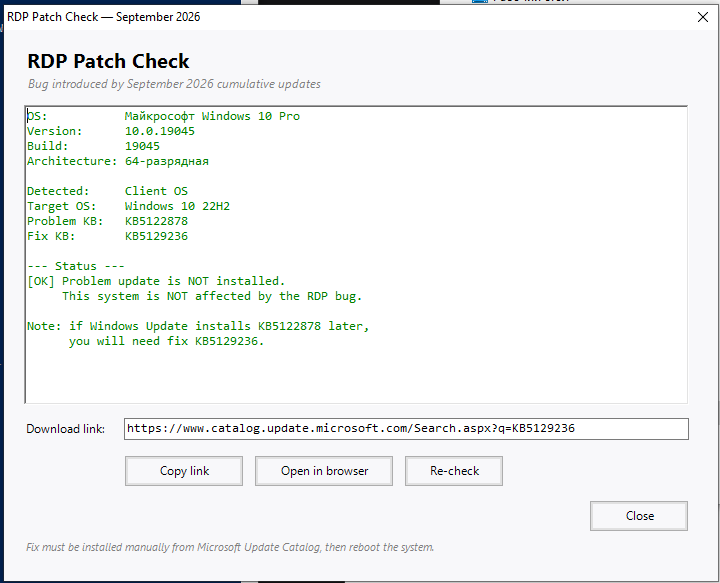

# Check-RdpPatch

Диагностический инструмент для проверки уязвимости Windows к **RDP-багу сентября 2026** и поиска исправляющего патча.



---

## Проблема

Сентябрьские накопительные обновления 2026 года сломали службу удалённых рабочих столов на Windows Server 2012–2025 и Windows 10/11.

**Симптомы:**
- RDP зависает на экранах «Инициализация удаленного подключения», «Защита удаленного подключения», «Подождите, идет настройка удаленного рабочего стола».
- События **ID 7011** (тайм-аут 30000 мс) для `NlaSvc`, `iphlpsvc`, `UmRdpService`.
- Перестают отвечать `mmc.exe`, Проводник, Центр обновления.
- `TermService` может числиться `RUNNING`, но не обслуживать подключения.

**Матрица патчей:**

| ОС | Проблемное обновление | Исправление |
|---|---|---|
| Server 2012 | KB5123065 | KB5129244 |
| Server 2012 R2 | KB5123066 | KB5129243 |
| Server 2016 | KB5123099 | KB5129239 |
| Server 2019 | KB5122876 | KB5129238 |
| Server 2022 | KB5122882 | KB5129237 |
| Server 2025 | KB5122871 | KB5129235 |
| Windows 10 (1507–22H2, LTSC) | KB5123099 / KB5122876 / KB5122878 | KB5129239 / KB5129238 / KB5129236 |
| Windows 11 (21H2–26H1) | KB5122880 / KB5124008 / KB5124012 | KB5129242 / KB5129195 / KB5129194 |

---

## Что делает

1. Определяет ОС по `BuildNumber`.
2. Различает Server / Client (по `Caption -match "Server"`).
3. Проверяет наличие проблемного обновления через `Get-HotFix`.
4. Проверяет наличие исправления.
5. Выводит вердикт и ссылку на Microsoft Update Catalog.

---

## Поддерживаемые ОС

**Server:** 2012, 2012 R2, 2016, 2019, 2022, 2025.

**Client:** Windows 10 (1507, 1511, 1607, 1703, 1709, 1803, 1809, 1903, 1909, 2004–22H2, LTSC 2015/2016/2019), Windows 11 (21H2–26H1).

---

## Файлы
- Check-RdpPatch.ps1 # Консольная версия
- Check-RdpPatch-GUI.ps1 # GUI (WinForms)
- Check-RdpPatch.exe # Собранный бинарник
- Check-RdpPatch-screenshot.png # Скриншот GUI
- README.md
- CHANGELOG.md


---

## Требования

- PowerShell 5.1+ (встроен в Windows 10/11 и Server 2016+).
- Обычные права пользователя (админ не требуется).
- Для сборки EXE: модуль `ps2exe`.

Разрешить запуск `.ps1`:

```powershell
Set-ExecutionPolicy -Scope CurrentUser -ExecutionPolicy RemoteSigned

Запуск

Консоль:
powershell

.\Check-RdpPatch.ps1

Открыть ссылку в браузере сразу:
powershell

.\Check-RdpPatch.ps1 -OpenLink

GUI:
powershell

.\Check-RdpPatch-GUI.ps1

или двойным кликом по Check-RdpPatch.exe.

Вердикты
Ситуация	Вердикт	Действие
Проблемное не установлено	✅ Не затронута	Следить за обновлениями
Проблемное + исправление	✅ Защищена	Нет
Проблемное без исправления	❌ Требуется патч	Скачать, установить, перезагрузить
Установка патча

    Открыть ссылку из скрипта (кнопка Open in browser).

    Найти пакет x64, нажать Download.

    Скопировать актуальный URL на .msu — динамические ссылки Microsoft быстро устаревают.

    Установить:

powershell

Start-Process wusa.exe -ArgumentList "C:\Temp\KBxxxxxxx.msu /quiet /norestart" -Wait
Get-HotFix -Id KBxxxxxxx
Restart-Computer -Force

Перезагрузка обязательна — без неё патч не вступает в силу.
Интерфейс GUI

    Поле вывода — результаты с цветовой подсветкой.

    Download link — URL каталога Microsoft.

    Copy link — копирует URL в буфер обмена.

    Open in browser — открывает ссылку.

    Re-check — перезапускает проверку.

    Close — закрывает окно.

Кнопки ссылки неактивны, если патч не требуется.
Известные нюансы

    Кодировка консоли: вывод на английском, чтобы избежать кракозябр в CP866.

    SmartScreen блокирует неподписанный EXE → «Подробнее» → «Выполнить в любом случае».

    Антивирусы могут помечать EXE от PS2EXE как подозрительный — добавить в исключения.

    Ссылки на .msu в каталоге Microsoft динамические, не сохранять в закладки.

    Get-HotFix возвращает пусто → запустить PowerShell от имени администратора.

CHANGELOG

См. CHANGELOG.md.
Лицензия

Внутренний инструмент. Свободен для использования и модификации внутри инфраструктуры.
text


